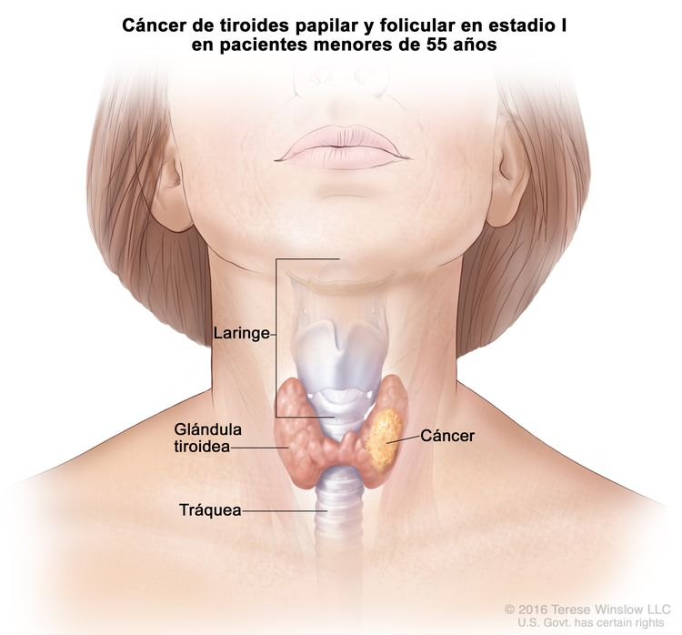
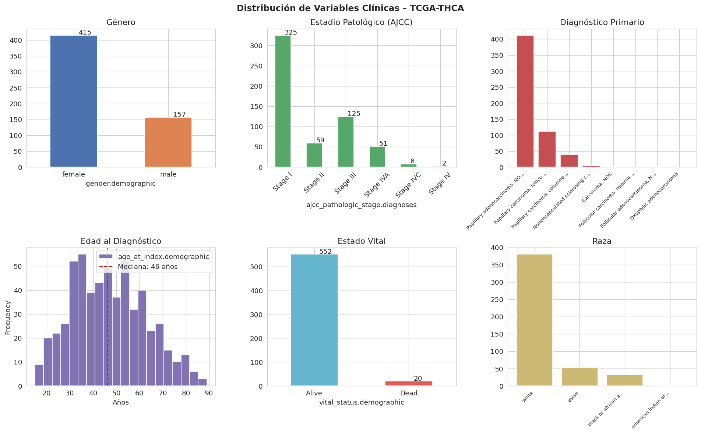
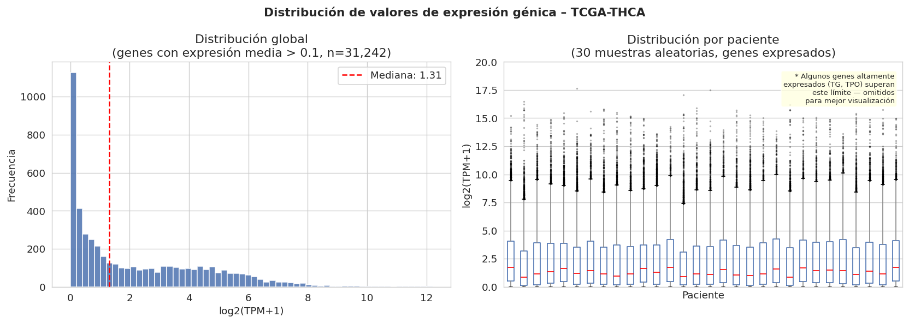
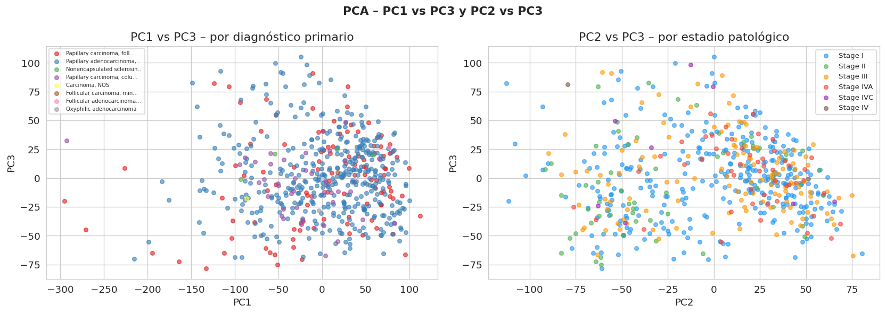
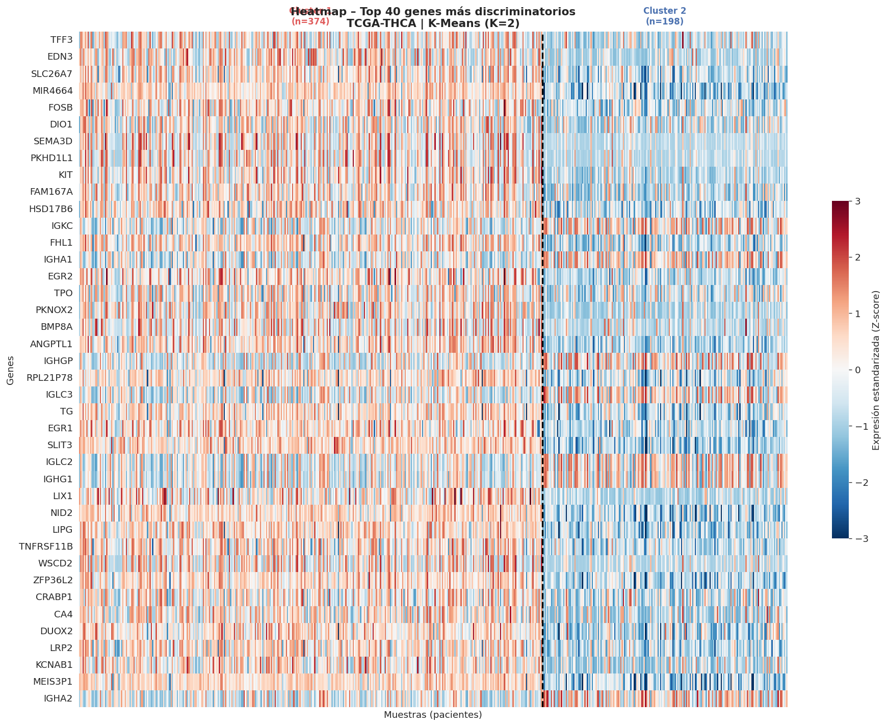
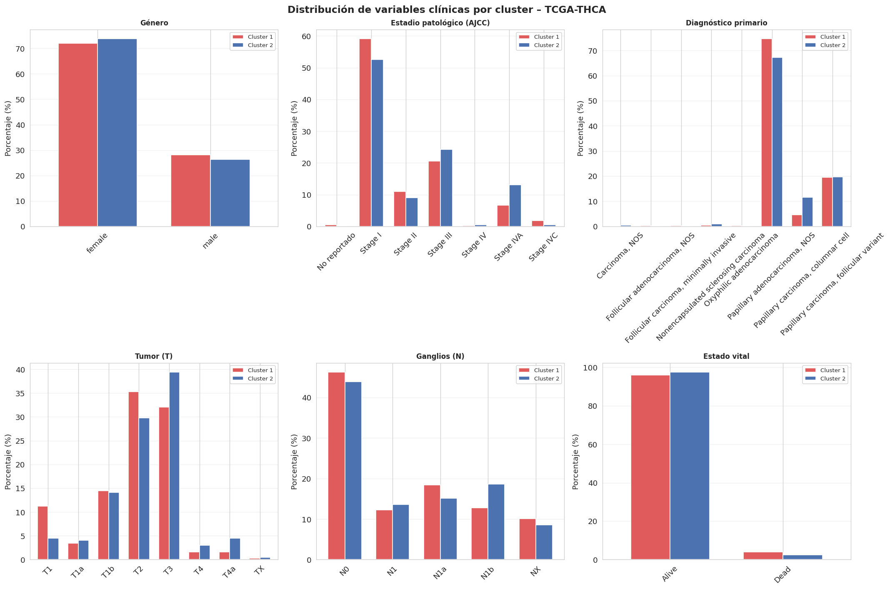

# Análisis de Subtipos Moleculares en Cáncer de Tiroides (THCA)

<p align="center">
  
  
  
  
  
</p>

<p align="center">
  <a href="https://colab.research.google.com/github/douglasbarbosaoliveira/tcga-thca-clustering-analysis/blob/main/AnalisisCancerTireoidesTCGATHCA.ipynb">
    
  </a>
</p>


> 📋 **El reporte completo está escrito en español / The full report is written in Spanish / O relatório completo está escrito em espanhol.**

---

🌐 **Idioma / Language / Idioma:**
[🇲🇽 Español](#-español) · [🇺🇸 English](#-english) · [🇧🇷 Português](#-português)

---

## 🇲🇽 Español

<details open>
<summary><strong>Ver en español</strong></summary>

### Descripción

Este proyecto aplica técnicas de **aprendizaje no supervisado** sobre datos de expresión génica del cohort **TCGA-THCA** para identificar subgrupos moleculares de pacientes y explorar su relación con variables clínicas relevantes.

<p align="center">
  
  <br/>
  <em>Glándula tiroidea con cáncer papilar y folicular en estadio I — Terese Winslow LLC / NCI</em>
</p>

### Datos

Accedidos a través de [UCSC Xena](https://xenabrowser.net) — cohort **GDC TCGA Thyroid Cancer (THCA)**:

| Dataset | Descripción | Muestras |
|---|---|---|
| `TCGA-THCA.star_tpm.tsv` | Expresión génica STAR-TPM log2(TPM+1) | 572 |
| `TCGA-THCA.clinical.tsv` | Variables clínicas y demográficas | 572 |
| `TCGA-THCA.survival.tsv` | Datos de supervivencia | 572 |

### Metodología

1. **Exploración y preparación** — Filtrado por varianza (top 25%), escalamiento Z-score
2. **Reducción de dimensionalidad** — PCA (56 componentes, 80.1% de varianza)
3. **Clustering** — K-Means (K=2) + Hierarchical Clustering (enlace completo, correlación)
4. **Análisis de genes** — Prueba t de Welch + corrección FDR (Benjamini-Hochberg)
5. **Análisis clínico** — Comparación de variables clínicas entre clusters

### Resultados principales

- ✅ **2 subgrupos moleculares** identificados con 92.7% de concordancia entre métodos
- ✅ **8,354 genes** diferencialmente expresados (FDR < 0.05)
- ✅ Perfil **tipo-RAS** (Cluster 1, n=374) — mayor diferenciación tiroidea
- ✅ Perfil **tipo-BRAF** (Cluster 2, n=198) — menor diferenciación, estadios más avanzados
- ✅ Resultados consistentes con **Boucai et al. (2021)**

### Visualizaciones

**Distribución de variables clínicas**
<p align="center">
  
</p>

**Distribución de valores de expresión génica**
<p align="center">
  
</p>

**PCA — PC1 vs PC3 y PC2 vs PC3**
<p align="center">
  
</p>

**Heatmap — Top 40 genes más discriminatorios**
<p align="center">
  
</p>

**Variables clínicas por cluster**
<p align="center">
  
</p>

### Referencia principal
> Boucai, L., et al. (2022). *Characterization of subtypes of BRAF-mutant papillary thyroid cancer defined by their thyroid differentiation score.* Journal of Clinical Endocrinology & Metabolism, 107(4), 1030–1039. https://doi.org/10.1210/clinem/dgab851

</details>

---

## 🇺🇸 English

<details>
<summary><strong>Read in English</strong></summary>

### Description

This project applies **unsupervised learning** techniques to gene expression data from the **TCGA-THCA** (Thyroid Cancer) cohort to identify molecular subgroups of patients and explore their relationship with relevant clinical variables.

### Data

Accessed through [UCSC Xena](https://xenabrowser.net) — **GDC TCGA Thyroid Cancer (THCA)** cohort:

| Dataset | Description | Samples |
|---|---|---|
| `TCGA-THCA.star_tpm.tsv` | Gene expression STAR-TPM log2(TPM+1) | 572 |
| `TCGA-THCA.clinical.tsv` | Clinical and demographic variables | 572 |
| `TCGA-THCA.survival.tsv` | Survival data | 572 |

### Methodology

1. **Exploration and preparation** — Variance filtering (top 25%), Z-score scaling
2. **Dimensionality reduction** — PCA (56 components, 80.1% variance)
3. **Clustering** — K-Means (K=2) + Hierarchical Clustering (complete linkage, correlation)
4. **Gene analysis** — Welch's t-test + FDR correction (Benjamini-Hochberg)
5. **Clinical analysis** — Comparison of clinical variables between clusters

### Key Results

- ✅ **2 molecular subgroups** identified with 92.7% concordance between methods
- ✅ **8,354 differentially expressed genes** (FDR < 0.05)
- ✅ **RAS-like profile** (Cluster 1, n=374) — higher thyroid differentiation
- ✅ **BRAF-like profile** (Cluster 2, n=198) — lower differentiation, more advanced stages
- ✅ Results consistent with **Boucai et al. (2021)**

### Main Reference
> Boucai, L., et al. (2022). *Characterization of subtypes of BRAF-mutant papillary thyroid cancer defined by their thyroid differentiation score.* Journal of Clinical Endocrinology & Metabolism, 107(4), 1030–1039. https://doi.org/10.1210/clinem/dgab851

</details>

---

## 🇧🇷 Português

<details>
<summary><strong>Ler em Português</strong></summary>

### Descrição

Este projeto aplica técnicas de **aprendizado não supervisionado** sobre dados de expressão gênica do coorte **TCGA-THCA** para identificar subgrupos moleculares de pacientes e explorar sua relação com variáveis clínicas relevantes.

### Dados

Acessados através da plataforma [UCSC Xena](https://xenabrowser.net) — coorte **GDC TCGA Thyroid Cancer (THCA)**:

| Dataset | Descrição | Amostras |
|---|---|---|
| `TCGA-THCA.star_tpm.tsv` | Expressão gênica STAR-TPM log2(TPM+1) | 572 |
| `TCGA-THCA.clinical.tsv` | Variáveis clínicas e demográficas | 572 |
| `TCGA-THCA.survival.tsv` | Dados de sobrevivência | 572 |

### Metodologia

1. **Exploração e preparação** — Filtragem por variância (top 25%), escalonamento Z-score
2. **Redução de dimensionalidade** — PCA (56 componentes, 80.1% de variância)
3. **Clustering** — K-Means (K=2) + Agrupamento Hierárquico (enlace completo, correlação)
4. **Análise de genes** — Teste t de Welch + correção FDR (Benjamini-Hochberg)
5. **Análise clínica** — Comparação de variáveis clínicas entre clusters

### Resultados principais

- ✅ **2 subgrupos moleculares** identificados com 92.7% de concordância entre métodos
- ✅ **8.354 genes** diferencialmente expressos (FDR < 0.05)
- ✅ Perfil **tipo-RAS** (Cluster 1, n=374) — maior diferenciação tireoidiana
- ✅ Perfil **tipo-BRAF** (Cluster 2, n=198) — menor diferenciação, estágios mais avançados
- ✅ Resultados consistentes com **Boucai et al. (2021)**

### Referência principal
> Boucai, L., et al. (2022). *Characterization of subtypes of BRAF-mutant papillary thyroid cancer defined by their thyroid differentiation score.* Journal of Clinical Endocrinology & Metabolism, 107(4), 1030–1039. https://doi.org/10.1210/clinem/dgab851

</details>

---

## 📁 Estructura del repositorio

```
📦 tcga-thca-clustering-analysis
 ┣ 📓 AnalisisCancerTireoidesTCGATHCA.ipynb   ← Reporte interactivo / Interactive report / Relatório interativo
 ┣ 📄 index.html    ← Versión estática / Static version / Versão estática
 ┣ 📄 README.md
 ┗ 📁 images/
    ┣ 🖼️ cancertireoides.jpg
    ┣ 🖼️ variablesclinicas.png
    ┣ 🖼️ valoresexpresiongenica.png
    ┣ 🖼️ pc1xpc3-pc2xpc3.png
    ┣ 🖼️ heatmap.png
    ┗ 🖼️ variablescluster.png
```

---

## 👤 Autor / Author / Autor

**Douglas Barbosa de Oliveira**

SC3314 – Inteligencia Artificial · Universidad de Monterrey

---

## 📄 Licencia / License / Licença

Este proyecto es de uso académico.
This project is for academic use only.
Este projeto é de uso acadêmico.

---

*Datos del TCGA accedidos vía UCSC Xena — Goldman et al., Nature Biotechnology, 2020.*
